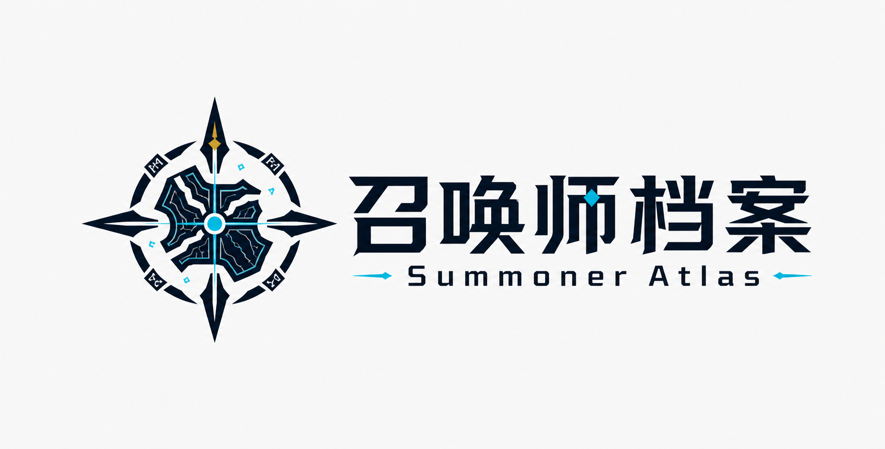

# 소환사의 아틀라스

> 여러 서버의 리그 오브 레전드 데이터를 한눈에 보는 지도.

[简体中文](README.zh.md) · [English](README.md)

소환사의 아틀라스(Summoner Atlas)는 서버, 패치, 게임 모드별 챔피언, 아이템, 룬, 플레이 메타를 빠르게 이해할 수 있도록 돕는 리그 오브 레전드 데이터 플랫폼입니다.

이 프로젝트는 현재 리디자인 계획 단계입니다. 전체 제품, 디자인 및 구현 명세는 [REDESIGN_PLAN.md](REDESIGN_PLAN.md)에서 확인할 수 있습니다.

## 제품 목표

- 중국, 한국, 북미, 대만, 유럽 등 여러 서버 지역을 지원합니다.
- 소환사의 협곡, 칼바람 나락, 아레나 및 향후 게임 모드를 지원합니다.
- 챔피언, 증강, 아이템, 룬, 패치 변화 및 조합 연구 데이터를 제공합니다.
- 패치 문맥과 표본 수를 함께 보여 주어 빠르고 신뢰할 수 있는 판단을 돕습니다.

## 계획된 기능

- 챔피언 이름, 중국어 병음, 별칭, 증강 이름을 지원하는 통합 검색.
- 패치, 지역, 모드, 역할, 품질 및 정렬 필터를 갖춘 챔피언 및 증강 랭킹.
- 추천 빌드, 스킬, 아이템, 룬, 증강, 조합 데이터를 제공하는 챔피언 상세 페이지.
- 챔피언을 역으로 찾을 수 있는 증강 상세 페이지.
- 조합 연구 및 패치 추세 분석.
- 사용자 계정, 외부 계정 연동, 환경설정 및 관리자 콘솔.

## 계획된 기술 스택

- Next.js 16
- TypeScript
- pnpm monorepo
- Base UI 프리미티브 기반 shadcn/ui
- Zustand
- Hugeicons

## 디자인 원칙

- 원시 데이터보다 실행 가능한 결론을 먼저 보여 줍니다.
- 모든 기기에서 빠르게 조회할 수 있어야 하며, 모바일에서 데스크톱 표를 억지로 축소하지 않습니다.
- 패치, 데이터 갱신 시간, 표본 수, 신뢰 수준을 명확히 표시합니다.
- 접근 가능한 시맨틱, 포커스 상태, 피드백 상태를 구축합니다.
- 독자적인 시각 정체성을 유지하며 Riot Games 로고나 공식 게임 에셋을 브랜드 표식으로 사용하지 않습니다.

## 문서

- [简体中文 README](README.zh.md)
- [English README](README.md)

## 개발 상태

이 저장소는 현재 제품 및 프런트엔드 리디자인 준비를 위한 공간입니다. 구현 시에는 [REDESIGN_PLAN.md](REDESIGN_PLAN.md)의 기능 이전 계약과 단계별 승인 기준을 기준으로 삼아야 합니다. 계획된 기능을 이미 출시된 기능처럼 표현하지 마세요.

## 면책 조항

소환사의 아틀라스는 독립적인 커뮤니티 데이터 프로젝트이며 Riot Games와 제휴 관계가 없습니다. `League of Legends` 및 관련 표식은 Riot Games, Inc.의 상표 또는 등록 상표입니다. 정식 출시 전에 데이터 출처와 사용 방식에 대한 컴플라이언스 검토가 필요합니다.
